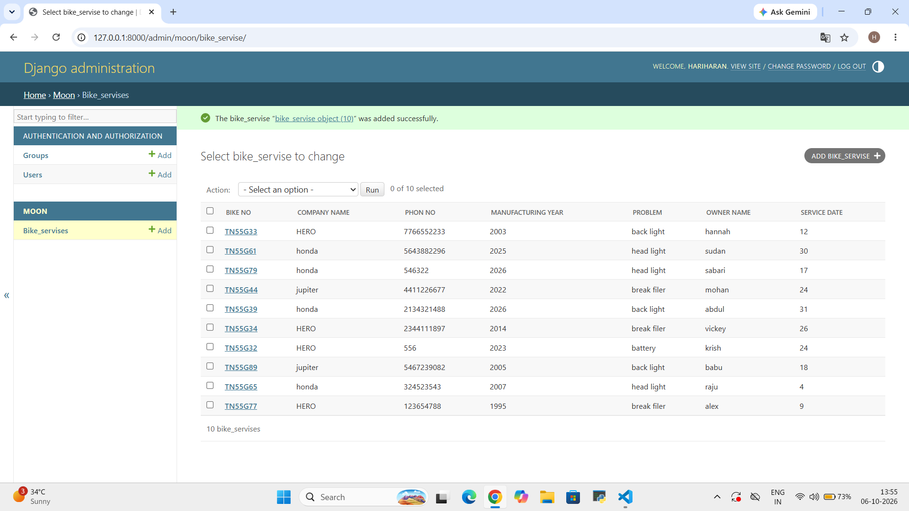

# Ex02 Django ORM Web Application
## Date: 

## AIM
To develop a Django Application to store and retrieve data from a Vehicle Service Database platform using Object Relational Mapping(ORM).

## ENTITY RELATIONSHIP DIAGRAM


## DESIGN STEPS

### STEP 1:
Clone the problem from GitHub

### STEP 2:
Create a new app in Django project

### STEP 3:
Enter the code for admin.py and models.py

### STEP 4:
Detect changes and create migration files that describe how to modify the database schema

### STEP 5:
Execute the migration files and update the database schema to match your Django models

### STEP 6:
Create a superuser with full access rights to all models and data through the admin interface.

### STEP 7:
Apply the migration files of the created app to the database

### STEP 8:
Execute Django admin using localhost and create details for 10 entries

## PROGRAM

```
models.py
from django.db import models
from django.contrib import admin
class bike_servise(models.Model):
    bike_no=models.CharField(primary_key=True)
    company_name=models.CharField(max_length=30)
    owner_name=models.CharField(max_length=20)
    service_date=models.IntegerField()
    problem=models.CharField()
    bike_no=models.CharField()
    phon_no=models.IntegerField()
    manufacturing_year=models.IntegerField()
class bike_servise_Admin(admin.ModelAdmin):
    list_display=("bike_no","company_name","phon_no","manufacturing_year","problem","owner_name","service_date")

admin.py
from django.contrib import admin    
from.models import bike_servise,bike_servise_Admin
admin.site.register(bike_servise,bike_servise_Admin)
```

## OUTPUT



## RESULT
Thus the program for creating Online Food Delivery Database using ORM hass been executed successfully
